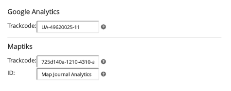

# Demo

**Cómo añadir una opción de configuración**

Vamos a ver las modificaciones para crear una pestaña del popup de "Settings" en el [Story Map Journal Analytics](https://github.com/hhkaos/storymap-journal-analytics) y en el que añadiremos la configuración de dos servicios: Google Analytics y Maptiks (reutilizando el código de la plantilla de Maptiks).

## Modificaciones

Vamos a necesitar crear/modificar los siguientes ficheros:

* src/app/storymaps/tpl/builder/settings/ViewAnalytics.html (nuevo)
* src/app/storymaps/tpl/builder/settings/ViewAnalytics.css (nuevo)
* src/app/storymaps/tpl/builder/settings/ViewAnalytics.js (nuevo)
* src/app/storymaps/tpl/core/WebApplicationData.js (modificamos)
* src/app/storymaps/tpl/core/Analytics.js (nuevo)
* src/app/storymaps/tpl/core/MainView.js (modificamos)
* src/app/storymaps/tpl/builder/BuilderView.js  (modificamos)
* src/app/custom-scripts.js (modificamos)

### **[ViewAnalytics.html](https://github.com/hhkaos/storymap-journal-analytics/blob/master/src/app/storymaps/tpl/builder/settings/ViewAnalytics.html) + [ViewAnalytics.css](https://github.com/hhkaos/storymap-journal-analytics/blob/master/src/app/storymaps/tpl/builder/settings/ViewAnalytics.css)**

Definen la interfaz para añadir los campos:

### **[ViewAnalytics.js](https://github.com/hhkaos/storymap-journal-analytics/blob/master/src/app/storymaps/tpl/builder/settings/ViewAnalytics.js)**

Define los métodos para inicializar la vista (`init`), cargar los valores guardados en la vista (`present`) y devolver los valores establecidos al guardar a la core (`save`).

### **[WebApplicationData.js](https://github.com/hhkaos/storymap-journal-analytics/blob/master/src/app/storymaps/tpl/core/WebApplicationData.js)**

Definimos los métodos [getAnalytics()](https://github.com/hhkaos/storymap-journal-analytics/blob/master/src/app/storymaps/tpl/core/WebApplicationData.js#L385) y [setAnalytics()](https://github.com/hhkaos/storymap-journal-analytics/blob/master/src/app/storymaps/tpl/core/WebApplicationData.js#L389) que se encargarán de llamar a los métodos para persistir y recuperar los datos almacenados.

### **[Analytics.js](https://github.com/hhkaos/storymap-journal-analytics/blob/master/src/app/storymaps/tpl/core/Analytics.js)**

Configura e inicializar el servicio de Maptiks si el identificador ha sido establecido ya desde el builder.

### **[MainView.js](https://github.com/hhkaos/storymap-journal-analytics/blob/master/src/app/storymaps/tpl/core/MainView.js)**

[Cargamos el módulo](https://github.com/hhkaos/storymap-journal-analytics/blob/master/src/app/storymaps/tpl/core/MainView.js#L2)  creado anteriormente para que se lance ha cargar la aplicación.

### **[BuilderView.js](https://github.com/hhkaos/storymap-journal-analytics/blob/master/src/app/storymaps/tpl/builder/BuilderView.js)**

Incluímos las siguientes modificaciones

* Cargamos la nueva vista en el BuilderView
* [Cargamos ViewAnalytics.js](https://github.com/hhkaos/storymap-journal-analytics/commit/761fc7f234b3afcf8a8896700f6524d14a99fee1#diff-0e51faaaf34cfb6555ca2bf783f7c7faL18)
* [Inicializamos la vista](https://github.com/hhkaos/storymap-journal-analytics/blob/761fc7f234b3afcf8a8896700f6524d14a99fee1/src/app/storymaps/tpl/builder/BuilderView.js#L400)
* Incluimos el método para [cargar los valores almacenados](https://github.com/hhkaos/storymap-journal-analytics/blob/761fc7f234b3afcf8a8896700f6524d14a99fee1/src/app/storymaps/tpl/builder/BuilderView.js#L417) al abrir el popup
* Incluimos el método para [guardar los valores](https://github.com/hhkaos/storymap-journal-analytics/blob/761fc7f234b3afcf8a8896700f6524d14a99fee1/src/app/storymaps/tpl/builder/BuilderView.js#L444) al cerrar el popup

### **[custom-scripts.js](https://github.com/hhkaos/storymap-journal-analytics/blob/761fc7f234b3afcf8a8896700f6524d14a99fee1/src/app/custom-scripts.js)**

El último paso es eliminar el código de "Google Analytics" hardcodeado en el [index.html](https://github.com/hhkaos/storymap-journal-analytics/commit/761fc7f234b3afcf8a8896700f6524d14a99fee1#diff-e249faefed5757034596c5096d33dab6L353) y [cargar el código de manera dinámica](https://github.com/hhkaos/storymap-journal-analytics/blob/master/src/app/custom-scripts.js#L15) usando el método `app.data.getWebAppData().getAnalytics()` definido en [WebApplicationData.js](https://github.com/hhkaos/storymap-journal-analytics/blob/master/src/app/storymaps/tpl/core/WebApplicationData.js).
